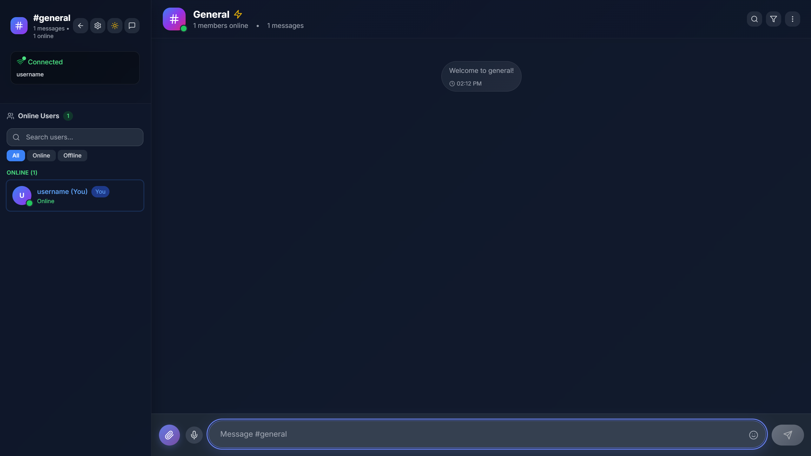

Mumegle – Real-Time Chatrooms & Stranger Video Chat
Live Demo: https://mumegle.vercel.app/
Backend API: https://mumegle.up.railway.app/

🚀 Overview
Mumegle is a full-stack, real-time chat platform that combines classic chatrooms with a modern “chat with strangers” experience—including one-click video calls. Built with React, FastAPI, Socket.IO, and WebRTC, Mumegle delivers seamless messaging, file sharing, and peer-to-peer video chat in a beautiful, responsive UI.

✨ Features
🗨️ Chatrooms
Join with a Nickname: Enter any room with a display name—no registration required.

Real-Time Messaging: Instant message delivery via Socket.IO.

Message Reactions: React to any message with emojis.

Replies, Edit & Delete: Reply to, edit, or delete your own messages.

File & Voice Messages: Share files or record/send voice messages with waveform playback.

User Presence: See who’s online; start private chats with anyone in the room.

🤝 Stranger Chat
Anonymous Matching: Get paired with a random stranger for a text chat.

Interest Tags: Add interests to find better matches.

Video Calls: Start a secure, peer-to-peer video call with your match (WebRTC).

Skip & Rematch: Instantly skip to a new stranger.

Typing Indicators & Reactions: Real-time typing status and emoji reactions.

🛠️ Tech Stack
Frontend: React, TypeScript, Tailwind CSS

Backend: FastAPI, Python-Socket.IO, WebRTC signaling

Deployment: Vercel (frontend), Railway (backend)

Other: CORS, REST endpoints for uploads, ephemeral file storage

🌐 Deployment
Frontend: https://mumegle.vercel.app/

Backend: https://mumegle.up.railway.app/

🚦 Getting Started

1. Clone the repository
   bash
   git clone https://github.com/yourusername/mumegle.git
   cd mumegle
2. Setup Backend
   bash
   cd backend
   python -m venv venv
   source venv/bin/activate # On Windows: venv\Scripts\activate
   pip install -r requirements.txt
   python main.py
   The backend will run on http://localhost:8000.

3. Setup Frontend
   bash
   cd frontend
   npm install
   npm start
   The frontend will run on http://localhost:3000.

4. Environment Variables
   Frontend:

REACT_APP_API_URL=http://localhost:8000
REACT_APP_SOCKET_URL=http://localhost:8000
Backend:
Configure CORS in main.py to allow your frontend domain.

📦 Project Structure
text
mumegle/
├── backend/
│ ├── main.py
│ ├── requirements.txt
│ └── ...
├── frontend/
│ ├── src/
│ ├── public/
│ └── ...

📸 Screenshots

  

Real-time WebSocket communication with Socket.IO and FastAPI

WebRTC peer-to-peer video call integration

Cloud deployment for both frontend (Vercel) & backend (Railway)

Building a modern, accessible, and responsive chat UI

🙌 Acknowledgements
Socket.IO

FastAPI

WebRTC

Vercel

Railway

💬 Contact
For feedback, questions, or collaboration, feel free to open an issue or contact me on LinkedIn.

Enjoy chatting on Mumegle!
